##  🤖 NetCoreAI.v2

> 🎓 Bu proje, **Murat Yücedağ** hocamızın hazırladığı Udemy'de bulunan 

> **"AI Masterclass: C# ile 20 Yapay Zeka Entegrasyonu Part 2"** eğitim serisi kapsamında geliştirilmiştir.

[📺 Eğitim serisine buradan ulaşabilirsiniz](https://www.udemy.com/course/ai-masterclass-csharp-ile-20-yapay-zeka-entegrasyonu-part-2/)

---

## 📋 Proje Hakkında

Bu proje, .NET 9.0 kullanarak geliştirdiğim ve 20 ayrı örnek projeden oluşan bir yapay zeka uygulamaları setidir. Amacım, farklı AI sağlayıcılarını tek bir çatı altında toplayarak; OpenAI, Anthropic Claude, Google Gemini, Hugging Face, Stability AI, Replicate, Deepgram ve Microsoft Azure gibi servislerin, projelere nasıl entegre edildiğini deneyimlemekti.

Projelerde; metin sınıflandırma, duygu analizi, özetleme, soru-cevap, named entity recognition (NER), toksik mesaj analizi, PDF ve haber özeti, ses–metin dönüşümü, görüntüden nesne ve açıklama çıkarma, metinden görüntü ve video üretimi gibi birçok farklı AI kullanım senaryosunu denedim.

Öne çıkan projeler arasında; Deepgram ile ses dosyasından otomatik transkript alma, Hugging Face modelleriyle sentiment analysis, özetleme ve NER, Anthropic Claude ile sohbet ve PDF özeti, Google Gemini ile soru-cevap, rol simülasyonu ve “auto agent” tarzı etkileşimli içerik planlama, OpenAI ile kod asistanı ve konuşan chatbot, Stability AI ve Replicate ile prompt’tan görsel ve video üretimi, Azure Computer Vision ile görsellerden açıklama ve obje tespiti, Azure TTS ile metinden ses üretimi gibi örnekler yer alıyor. 

Kısacası bu proje, yapay zekayı .NET projelerine nasıl entegre edebileceğimi öğrenmek, ileride daha büyük projelere altyapı oluşturmak için çalıştığım bir eğitim projesidir.

---

### 🤖 AI & ML Servisleri

## Hugging Face Inference API

- Sentiment Analysis (Twitter RoBERTa base)
- Text Summarization (DistilBART CNN)
- Named Entity Recognition (BERT NER)
- Question Answering (RoBERTa base SQuAD2)
- Toxic Comment Classification (Toxic-BERT)

## Anthropic Claude API

- Chatbot (Claude Sonnet 4)
- PDF içerik özeti
- Hazır prompt ile iş başvuru e-postası üretimi

## Google Gemini API

- Chatbot (Gemini 2.5 Pro)
- Rol Simülasyonu (psikolog, maç yorumcusu, yatırım uzmanı vb.)
- Auto-Agent içerik/fikir planlayıcı

## OpenAI API

- GPT‑3.5 / GPT‑4 (Chat Completions)
- Whisper (Audio Transcription)
- Kod asistanı (açıklama, refactor, test case)
- Speech Chatbot (Whisper + ChatGPT + TTS akışı)

## Stability AI – Stable Diffusion

- Prompt’tan yüksek çözünürlüklü görsel üretimi

## Replicate API

- Prompt’tan görsel üretimi
- Prompt’tan kısa video üretimi

## Deepgram API

- Ses dosyalarından otomatik transkript (Speech-to-Text)

## Microsoft Azure Cognitive Services

- Text-to-Speech (Türkçe seslendirme)
- Computer Vision (Image Captioning, Object Detection)

---

## 🖼️ Ekran Görüntüleri

  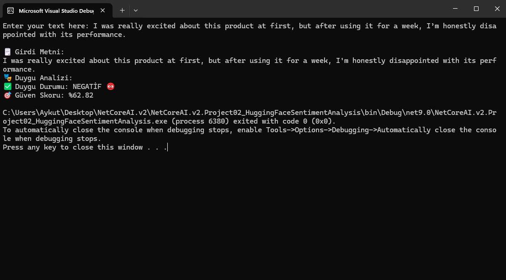
  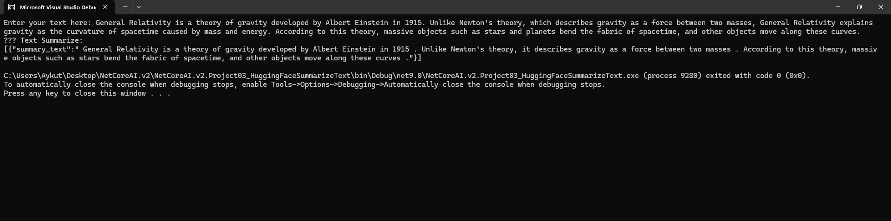
  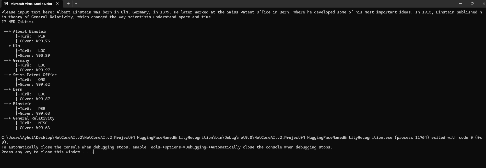
  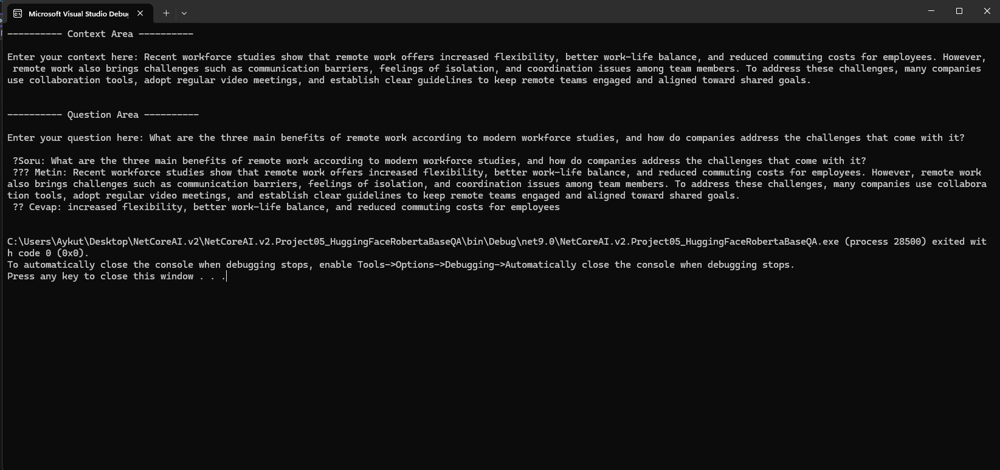
  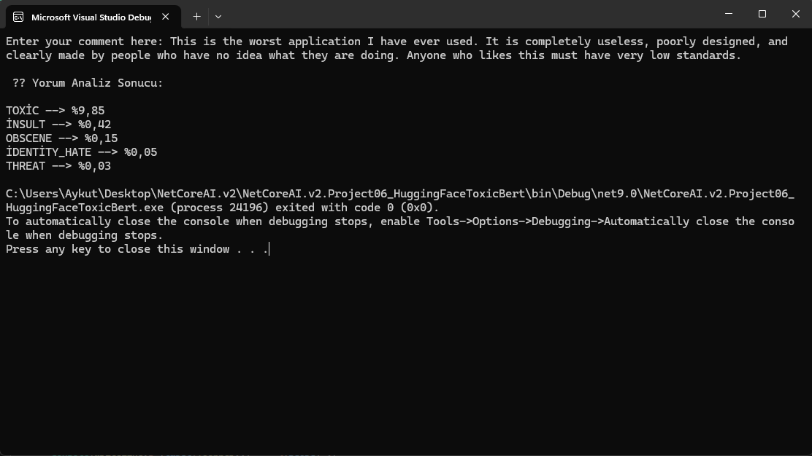
  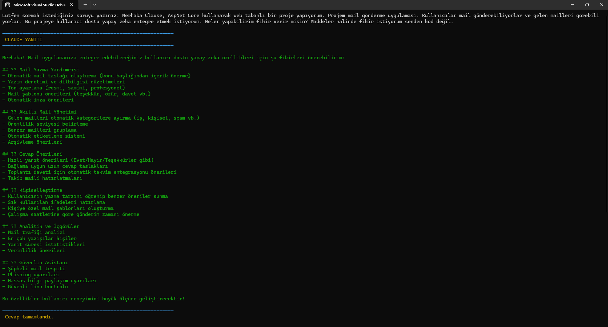
  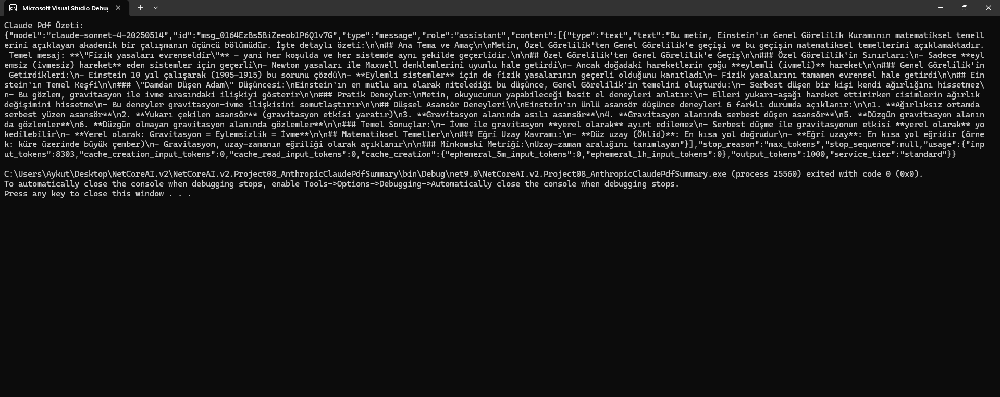
  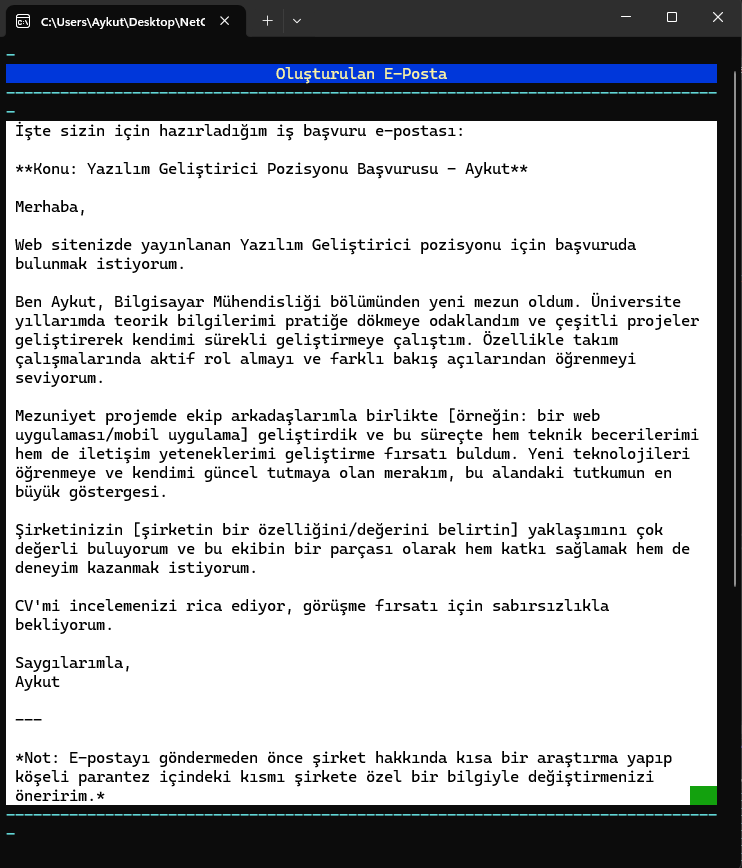
  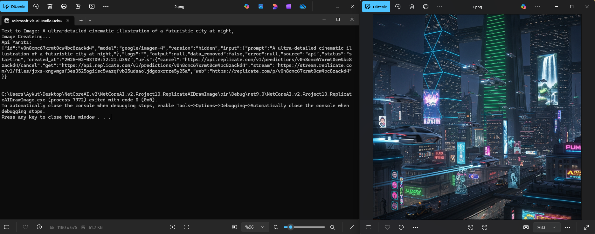
  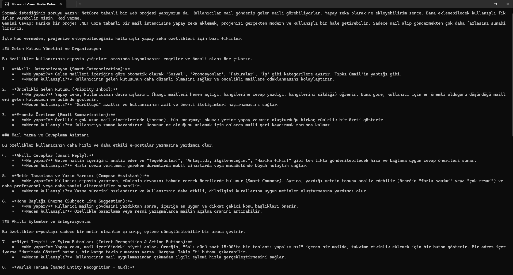
  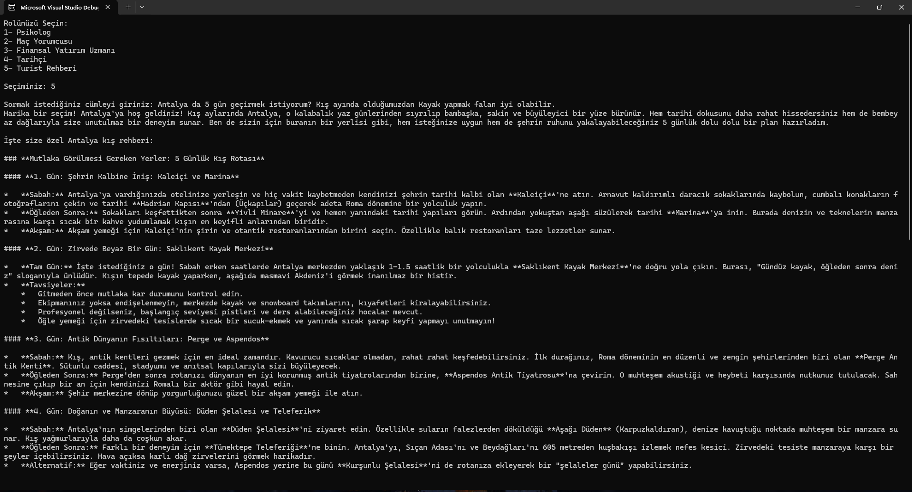
  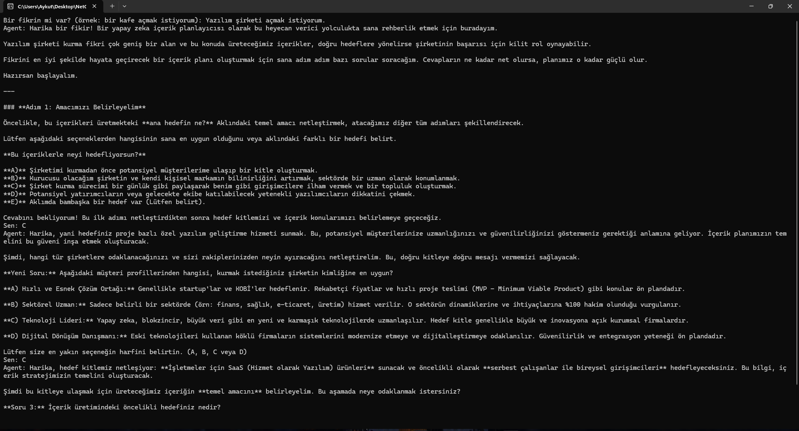
  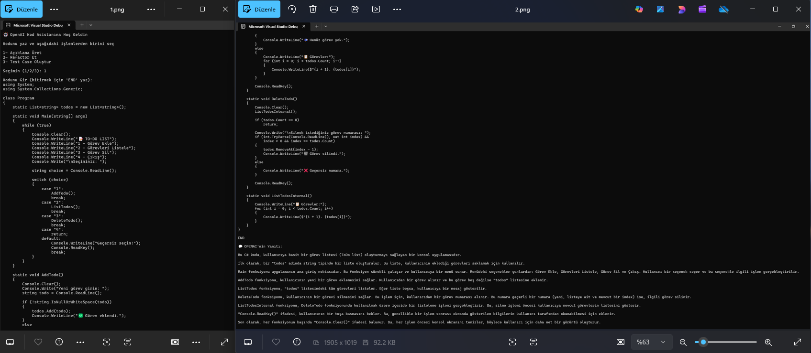
  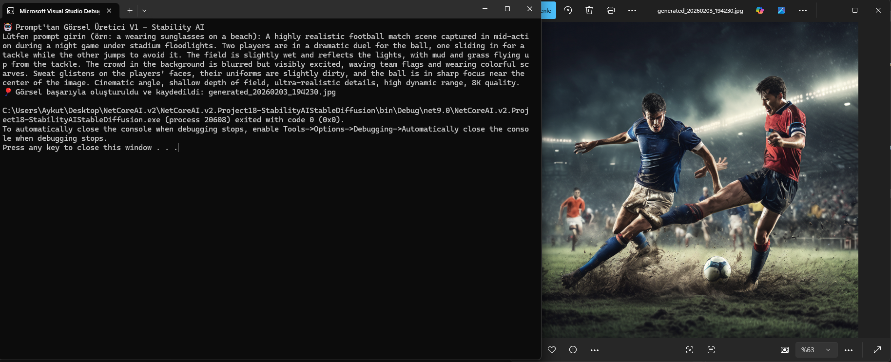
  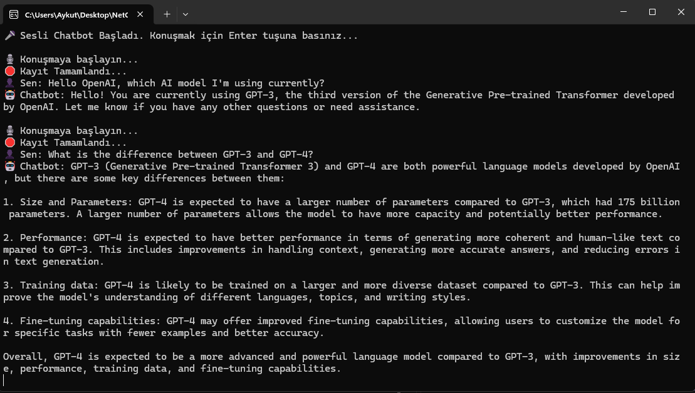

